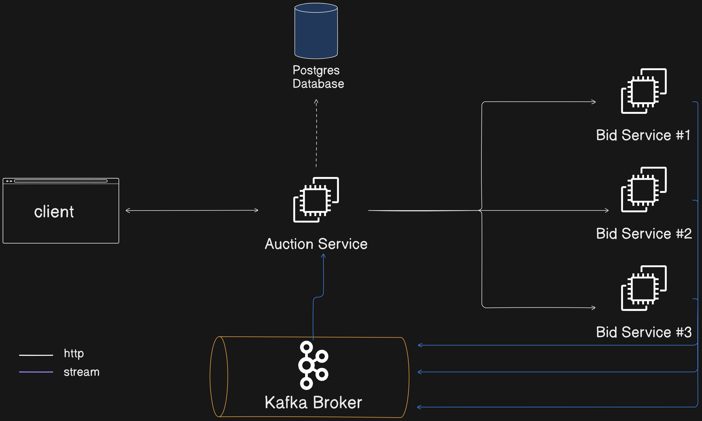

# Bidding and Auction

## Backend Assignment
- Design two services (Bidding and Auction) one which is bidding on an `AdRequest` and another which is performing the auction from multiple bidders.

### Bidding Service
1) Receives an `AdRequest` (http request) for an `AdObject` with `AdPlacementId`, which must be a unique string identifying an `Ad Slot` or an `Ad Spot`.
2) Every `AdRequest` must respond with an `AdObject` that must contain at least the `AdID` and `bidPrice` (random price for the `AdPlacementId` in USD)
3) Incase the bidding service does not want to buy an ad slot, the service must return a `204` status. This behaviour can be mocked using a random range per request received.
4) Incase the service bids for an `AdRequest`, it should return the `AdObject` with a `200` for the status code.

### Auction Service
1) The auction service shall call multiple biddings services at the same time
2) The auction service gets all the bids available from associated Bidding Services as `200` status code responses from valid bids.
3) Auction service should accept an `AdPlacementId` in an externally exposed API.
4) The auction service selects the bid for an `AdPlacementId` with the highest `bidPrice` amongst different services.
5) If there are no eligible bids by the bidding services in an auction, the service must return a `204` status code
6) The auction service must have a safety circuit to prevent bad bidding services to increase latency
7) If a bidding service does not respond within 200ms, the auction service must decline the bid for the auction coming from that specific bidding service

## Description

A simple project written in GO that has an Auction Service and Bidding service. The Auction service gets the bids from all the bidding services, and return back with the best bid.

I went a little further on the task and implemented Kafka to intermediate the concurrent requests coming from bidders.
I also added the repository pattern and persisted each highest bid and its id in Postgres.

## Architecture


## Installation

To install and set up the project, follow these steps:

1. Clone the repository: `git clone https://github.com/brunodev09/bidding-and-auction.git`

2. Have Postgres installed on your environment and create a database with the name "auction"

3. Edit the `docker-compose.yaml` file, specifically with your database credentials under the `auction` service
```
      - DB_HOST=host.docker.internal
      - DB_PORT=5432
      - DB_USER=postgres
      - DB_PASSWORD=yourpassword
      - DB_DATABASE=auction
      - DB_SSL=disable
```

4. Navigate to the project directory: `cd bidding-and-auction`

5. `make run` => this will run the docker compose up, and build the images and run 1 auction service and 3 bidding services together with Zookeeper -> Kafka (all of them in correct order)

  
## Usage
- Run the following command to make a request to the local server: 
 `curl http://localhost:8080/auction`

## Test
- For running the test you need to run the following command in the: `make test`